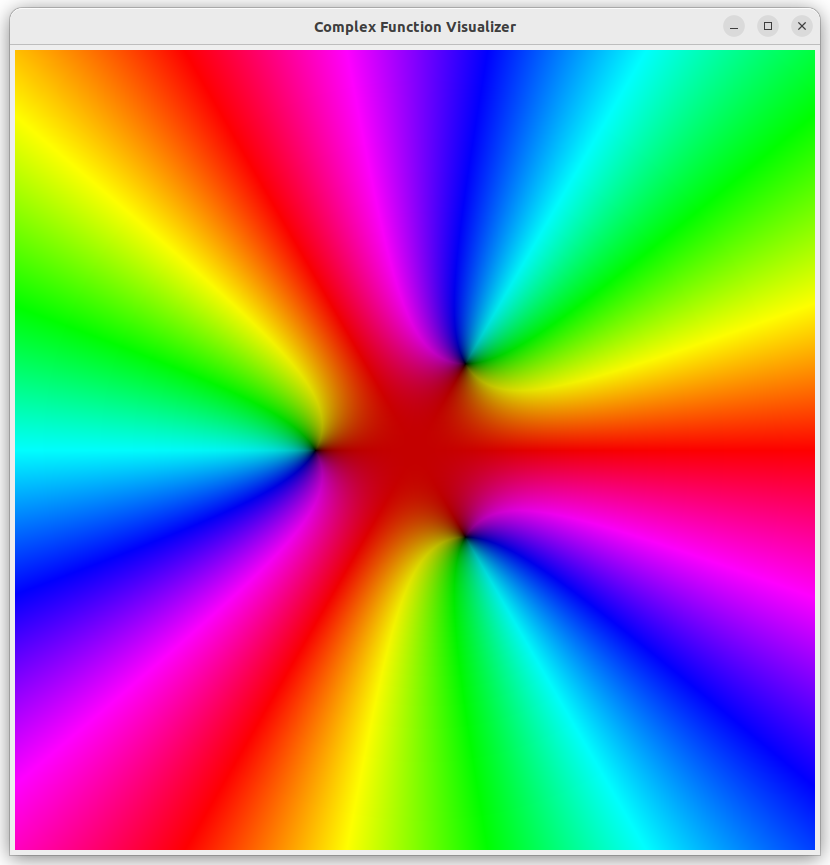

# Complex Function Viewer

*I have preserved this high school project as-is, only recently adding this readme.*

---

This application visualizes complex functions by coloring the plane. "Complex" here means containing imaginary numbers,
not "complicated". In our three-dimensional world with two-dimensional screens, functions of two and three variables
(like $y = x^2 - 4$ and $z = 3x - 2xy^2$) can be easily visualized. The inputs and outputs of complex functions are both
complex numbers. While this may seem like two variables, each complex number is represented with two values, $a + bi$,
and the function is four-dimensional.

Two represent this in 2D, we give a color to every point on the plane as in the above picture. Complex functions can be
thought of as a transformation that takes in points on the plane and moves them to another point on the plane.
We can color the original point based on where the transformed point ended up. For example, this is the quadratic
$f(z) = z^2 - 2$, with roots $-\sqrt{2}$ and $\sqrt{2}$. The roots are dark spots because they are transformed to near zero,
and near zero is colored darker in the above coloring scheme.

Here is the cubic $f(z) = z^3 + 1$. You can see the root at $-1$, and the other two equally spaced roots.

And here is the quintic $f(z) = z^5 -3z^4 + z^3 - 2$

