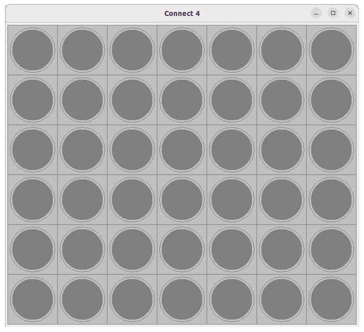

# Connect 4 AI

In this project, I use the minimax algorithm to create a Connect 4 AI. The key is the evaluation function:
my AI evaluates the board by if it is a win or lose condition, how many three-in-a-row pieces it and the opponent have,
and how many two-in-a-row pieces it and the opponent have. Opponent's three-in-a-rows are weighted more heavily,
so that the agent tries very hard to avoid these states. If it lets the opponent get three-in-a-row, that reduces the chance it will win.

I additionally use alpha-beta pruning to increase the search speed. Essentially, the agent can stop investigating down a sequence of moves
if it knows they are definitely worse than other moves it can take.

In the following game, I play as blue and the AI is red.

