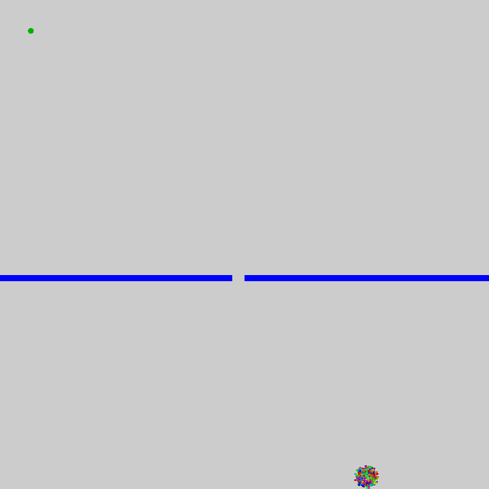

# Genetic Algorithms

The genetic algorithm is a machine learning algorithm based on the concept of evolution. Individuals within a population 
"compete" with each other, and the "fittest" individuals are more likely to "reproduce" and create offspring for the next generation.
The population as a whole evolves to become better at maximizing the fitness function.

### Overview

Let's explain this with an example. In the above visualization, each colored dot is an individual. The
*genome* of each individual controls their behavior. In this environment, each gene in the genome represents a movement
in an arbitrary direction, and the full genome is 1000 of these genes. The *fitness* of these individuals is measured by
how quickly and how close they can get to the goal (the green dot in the top left). Fitter individuals are then more likely
to be selected to reproduce.

### Reproduction

When two individuals reproduce with each other, their genomes are randomly shuffled together to produce an offspring.
In addition, random mutations are introduced to the offspring's genome, otherwise it would be impossible for the algorithm
to explore outside the search space of the initially randomly chosen genomes. The offspring's color is also a mixture its parents.
This is why the dots become greener over time.

### Conclusion

Though simple to implement, the genetic algorithm is not usually as effective as modern machine learning algorithms
like reinforcement learning, especially deep learning methods like actor-critic and policy gradient. However, the concepts
of the fitness function and random exploration of the search space are a great introduction to machine learning for young scientists.
