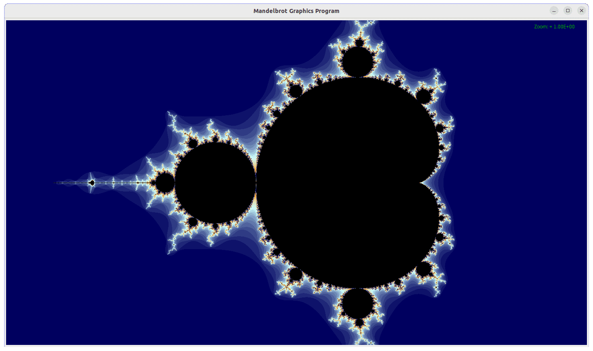

# Mandlebrot Set

An application to generate visualizations of the mandelbrot set, which is generated by iterating the equations $f(z) = z^2 + c$.

Click with the mouse to center the visualization on that point.
Pressing the number keys 1-5 will zoom out, with 1 zooming out the most and 5 the least.
Pressing the keys 6-0 will zoom in, with 6 zooming the least and 0 the most.
Pressing \ will reset to the default zoom and view. 

