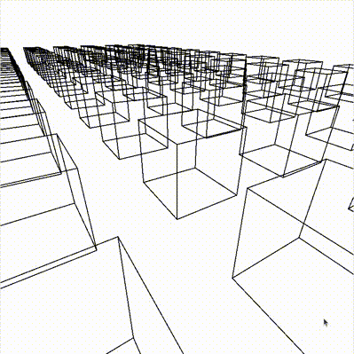

# Quaternions

In this project, I explore the use of quaternions for rotating and rendering objects in 3D.

Quaternions extend complex numbers to three dimensions. Just as a complex number $a + bi$ can represent a rotation
in two dimensions, quaternions, consisting of $a + bi + cj + dk$, can represent rotations in three dimensions.

Each of the cubes consists of a collection of points connected by lines. Using WASD, the spacebar, and the mouse, the player
can control the location and orientation of the camera. Using quaternions, the coordinates of the cube points are transformed
to the camera reference frame and rendered on the screen.
