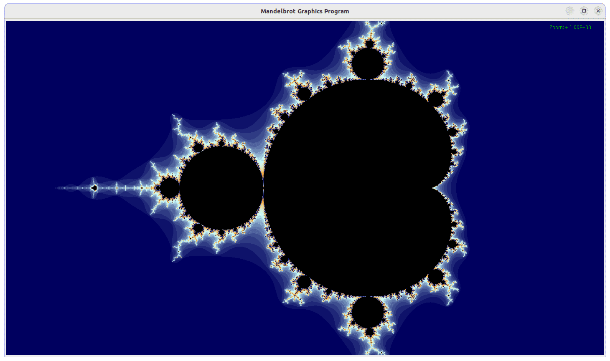

# Landing Page

I'm working on a personal website to showcase my work, as we speak. In the meantime, I have chosen
this repository to be my landing page. Click the links below to learn more about my projects.

[Cow Vs Aliens](CowVsAliens)

 

[Genetic Algorithm with Dots](GeneticAlgorithmDots)

[Mandelbrot Set Visualization](MandelbrotSet)

[Connect Four AI](Connect4)

[Complex Function Viewer](ComplexFunctionViewer)

[Wave Function Collapse](https://github.com/edf42001/programming-experiments/blob/main/wavefunction_collapse/README.md)

[Softbody Physics Simulation](https://github.com/edf42001/programming-experiments/blob/main/soft_body_physics/README.md)

You can also browse my other repositories on my [profile page](https://github.com/edf42001).
